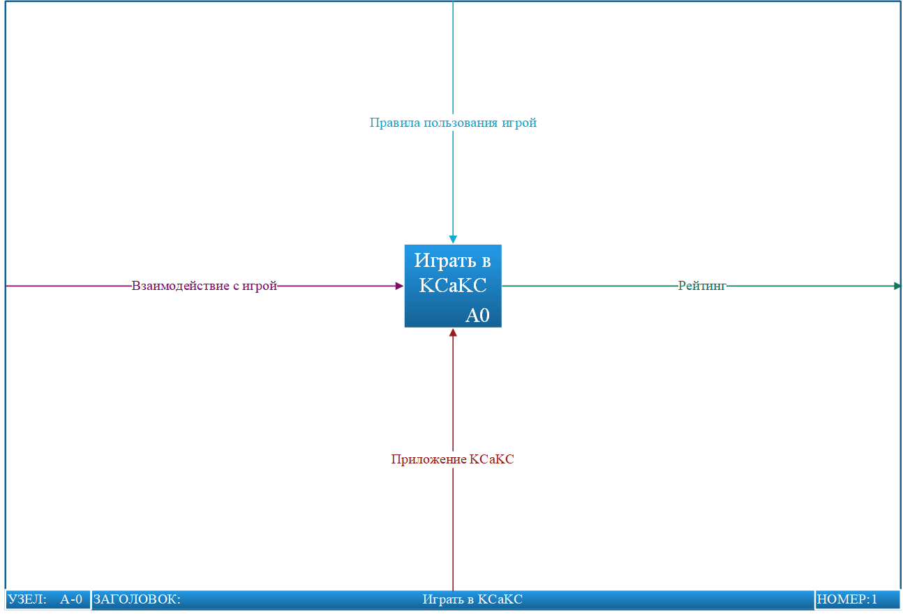

# KCaKC - Keep Calm and Kill Cockroaches
Игра для мобильных устройств на платформе Android [KCaKC.apk](KCaKC.apk)


[](https://www.youtube.com/watch?v=kAmYpKi5Y84)

Приложение осуществляет сбор данных о пульсе пользователя и его вариабельности, используя вспышку и камеру мобильного устройства в качестве сенсора.
Скорость игрового процесса должна варьируется в зависимости от регистрируемого состояния пользователя с целью его нормализации.

Состояние пользователя оценивается по показателю ВСР - индексу напряжения регуляторных систем (ИН), характеризующему активность механизмов симпатической регуляции, состояние центрального контура регуляции.
Этот показатель вычисляется на основании анализа распределения кардиоинтервалов.

## Описание работы приложения
При запуске приложения включается камера и вспышка телефона. Пользователю необходимо приложить палец к камере, чтобы начать считывать пульс. Как только собирается достаточно данных, на экране устройства должны отображаться числовые показатели пульса (уд. /мин) и ИН (усл. ед.). Для удобства восприятия числовых характеристик, исходя из показателя индекса напряженности, должен изменяться цвет фона экрана и появляться текстовое описание текущего состояния пользователя. Также на экране должны присутствовать индикатор ударов сердца в виде лампочки, мигающей при каждом ударе, и кнопка для начала игры.

По началу игры сверху вниз начинают ползти тараканы. Скорость их движения и генерации зависит от текущего индекса напряженности. По нажатии на таракана он умирает и, затем, исчезает. При отведении пальца от камеры игра останавливается и продолжается с того же места, как только пользователь вновь приложит палец к камере. Идея игры в том, чтобы убить как можно больше тараканов и не дать ни одному таракану доползти до нижней границы экрана. Если это все же произошло, игра завершается и пользователю выводится диалоговое окно с набранным рейтингом и поздравлением, если был побит рекорд. Далее пользователь может либо сразу начать новую игру, либо вернуться на начальный экран.

Во время игры пользователю должны отображаться текущий рейтинг и рекорд. Рейтинг равен количеству убитых тараканов за одну игру. Рекорд – максимальный рейтинг за все время, сохраняющийся при закрытии приложения.

| ИН, усл. ед.  | Цвет фона | Описание состояния | Скорость передвижения тараканов, % от максимально значения | Период генерации тараканов, с |
|:---:|:---:|:---:|:---:|:---:|
| от 1 до 10 | светло-красный | Резервы организма исчерпаны | 100% | 0.3 |
| от 10 до 20 | желтый | Вы на пределе | 90% | 0.35 |
| от 20 до 120 | зеленый | Норма | 80% | 0.4 |
| от 120 до 200 | желтый | Верхняя граница нормы | 70% | 0.45 |
| от 200 до 500 | оранжевый | Выше нормы | 60% | 0.5 |
| от 500 до 800 | светло-красный | Очень высокий | 50% | 0.55 |
| более 800 | темно-красный | Ваше сердце работает на износ | 30% | 0.6 |

Скоростные параметры подобраны таким образом, чтобы:
- играть было наиболее комфортно в нормальном состоянии,
- при пониженном ИН игра ускорялась и, тем самым, требовала от пользователя более быстрой реакции с целью взбодрить его,
- при повышенном ИН игра замедлялась и расслабляла пользователя.

Таким образом будет происходить корректировка функционального состояния пользователя для приведения его в нормальное состояние.

## Технологии реализации
Android-приложение написано на языке программирования Kotlin v.1.3.72 (SDK v.29).  
Для измерения ЧСС с помощью камеры и вспышки была использована библиотека [Heart-Rate-Ometer](https://github.com/kibotu/Heart-Rate-Ometer).  
В качестве системы сборки использовался Gradle v.5.6.4.

## Проектирование
### Функциональная модель в стандарте IDEF0



### Сценарий использования

### Диаграмма классов

### Модель данных
Приложение должно сохранять только одно значение - максимальный рейтинг пользователя.  
Это значение сохраняется с помощью SharedPreferences (файловая структура хранения данных в Android) под ключом "max_rate".

## Реализация
### Пользовательский интерфейс
|   |  |
|:---:|:---:|
| Макет в режиме дизайна | Макет в режиме чертежа |
### Алгоритм работы приложения
Для подсчета ИН фиксируется время каждого удара и записываются значения RR-интервалов в мс в список объекта hrv, отбрасывая слишком маленькие и слишком большие значения как шумовые.
При расчете ИН используется формула Р. М. Баевского, в которой стресс индекс (индекс напряжения регуляторных систем – SI) вычисляется путем деления амплитуды моды на удвоенное произведение моды на размах:  


Код вычисления ИН:
```kotlin
val msMo = msRRintervals.average()
val dx = 200
val amo = msRRintervals.filter { it >= msMo - dx && it <= msMo + dx }.size.toDouble() * 100 / msRRintervals.size
val mxdmn = (msRRintervals.max()!! - msRRintervals.min()!!).toDouble() / 1000
val si = (amo / (2 * mxdmn * msMo / 1000)).toInt()
```
| Переменная  | Показатель | Физиологическая интерпретация |
|:---:|:---:|:---:|
| mxdmn | Разность между максимальным и минимальным значениями кардиоинтервалов | Максимальная амплитуда регуляторных влияний |
| msMo | Мода | Наиболее вероятный уровень функционирования сердечно-сосудистой системы |
| amo | Амплитуда моды | Условный показатель активности симпатического звена регуляции |
| si | Стресс индекс (индекс напряжения регуляторных систем) | Степень напряжения регуляторных систем (степень преобладания активности центральных механизмов регуляции над автономными) |

Как только прикладывается палец, начинается считывание ударов сердца и сбор статистики.
Значения пульса и ИН выводятся с небольшим таймаутом, чтобы набрать необходимое минимальное количество данных для их расчета.
Далее в процессе игры сбор статистики продолжается и значения, выводимые на экран, становятся точнее.
ИН стабилизируется, примерно, через 2 минуты считывания пульса.
Одновременно с изменениями значений ИН меняется цвет фона и текстовое описание состояния организма, а также скорость игры, если она запущена.

По нажатии на кнопку «Начать игру» вызывается метод `startNewGame()`.
```kotlin
private fun startNewGame() {
    playButton.visibility = View.INVISIBLE
    rateBars.visibility = View.VISIBLE
    val mainHandler = Handler(Looper.getMainLooper())
    var prevState = false
    mainHandler.post(object : Runnable {
        override fun run() {
            val gameIsOn = bpm.text.toString() != "0" && si.text.toString() != "0"
            if (prevState != gameIsOn) setGameState(gameIsOn)
            cockroaches.setClickable(gameIsOn)
            if (gameIsOn) {
                if (!cockroaches.step(
                        pulse.getSiRate(),
                        this@MainActivity
                    )
                ) return gameOver()
            }
            prevState = gameIsOn
            mainHandler.postDelayed(this, 10)
        }
    })
}
```
В методе `startNewGame()` с периодом 10 мс в отдельном потоке запускается функция рендеринга игры. Объект cockroaches хранит список всех живых тараканов. На каждом шаге вызывается метод step этого объекта, который передвигает тараканов. Метод step принимает в параметрах величину ИН, по которой определяет, на какое расстояние за один шаг можно передвинуть тараканов и с каким периодом можно генерировать новых. Возвращается значение типа Boolean, говорящее о том, ни добрался ли хотя бы один таракан до нижней части экрана.

Тараканы появляются на экране как динамически создаваемые объекты ImageView. Их начальное положение и перемещения задаются за счет параметров внешних отступов (margin). При создании таракана для него задается обработчик события нажатия, в котором проигрывается звук удара, сменяется изображение с живого таракана на мертвого, инкрементируется текущий рейтинг и задается отложенная функция удаления ImageView с экрана, срабатывающая через 1с.